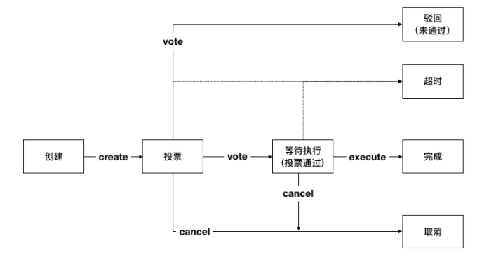

- [LiteSDK bvm文档](#litesdk-bvm文档)
  - [第一章. 前言](#第一章-前言)
  - [第二章.执行BVM提供的合约](#第二章执行bvm提供的合约)
    - [2.1 初始化](#21-初始化)
    - [2.2 执行bvm合约](#22-执行bvm合约)
      - [1. 合约接口](#1-合约接口)
      - [2. bvm交易体](#2-bvm交易体)
        - [HashContract](#hashcontract)
        - [MPCContract](#mpccontract)
        - [CertContract](#certcontract)
        - [ProposalContract](#proposalcontract)
          - [配置类](#配置类)
          - [权限类](#权限类)
          - [节点管理类](#节点管理类)
          - [合约命名类](#合约命名类)
          - [合约生命周期管理类](#合约生命周期管理类)
          - [ca模式类](#ca模式类)
        - [AccountContract](#accountcontract)
        - [RootCAContract](#rootcacontract)
      - [3. 创建请求](#3-创建请求)
      - [4. 发送交易体](#4-发送交易体)
      - [5. 解析回执](#5-解析回执)
    - [2.3 使用示例](#23-使用示例)
      - [HashContract使用示例](#hashcontract使用示例)
      - [MPCContract使用示例](#mpccontract使用示例)
      - [CertContract使用示例](#certcontract使用示例)
      - [ProposalContract使用示例](#proposalcontract使用示例)
        - [创建提案](#创建提案)
          - [配置类](#配置类-1)
          - [权限类](#权限类-1)
          - [节点类](#节点类)
          - [合约命名类](#合约命名类-1)
          - [合约生命周期管理类](#合约生命周期管理类-1)
          - [ca模式类](#ca模式类-1)
        - [提案投票](#提案投票)
        - [取消提案](#取消提案)
        - [执行提案](#执行提案)
        - [直接执行提案内容](#直接执行提案内容)
      - [AccountContract使用示例](#accountcontract使用示例)
      - [RootCAContract使用示例](#rootcacontract使用示例)
  - [第三章. ConfigService相关接口](#第三章-configservice相关接口)
    - [3.1 查询提案（getProposal）](#31-查询提案getproposal)
    - [3.2 查询配置（getConfig）](#32-查询配置getconfig)
    - [3.3 查询连接的节点信息（getHosts）](#33-查询连接的节点信息gethosts)
    - [3.4 查询参与共识的节点信息（getVset）](#34-查询参与共识的节点信息getvset)
    - [3.5 查询所以角色信息（getAllRoles）](#35-查询所以角色信息getallroles)
    - [3.6 查询角色是否存在（isRoleExist）](#36-查询角色是否存在isroleexist)
    - [3.7 根据合约地址查询合约命名（getNamebyAddress）](#37-根据合约地址查询合约命名getnamebyaddress)
    - [3.8 根据合约命名查询合约地址（getAddressByName）](#38-根据合约命名查询合约地址getaddressbyname)
    - [3.9 查询所有合约地址到合约命名的映射关系（getAllCNS）](#39-查询所有合约地址到合约命名的映射关系getallcns)
    - [3.10 查询创世信息（getGenesisInfo）](#310-查询创世信息getgenesisinfo)
  - [第四章 订阅提案信息](#第四章-订阅提案信息)
    - [4.1 订阅提案信息使用示例](#41-订阅提案信息使用示例)

# LiteSDK bvm文档

## 第一章. 前言

本文档是LiteSDK的补充文档，提供hyperchain中内置虚拟机（简称bvm）的使用指南。

## 第二章.执行BVM提供的合约

### 2.1 初始化

使用litesdk与节点交互分为以下几步：

1. 首先需要创建`HttpProvider`对象管理与节点的连接
2. 然后创建`ProviderManager`对象负责集成、管理`HttpProvider`
3. 然后再根据实际的需要创建相应的服务`Service`的具体实现类
4. 最后将请求发送出去拿到响应结果。

初始化的流程中litesdk的主文档中有详细介绍，此次不再赘述。需要说明的是bvm是hyperchain2.0中新加入的，在hyperchain中没有此功能。另外既然是执行合约，需要创建的也是`Service`的实现类`ContractService`。

### 2.2 执行bvm合约

#### 1. 合约接口

bvm合约主要通过`ContractService`提供的`invoke`接口执行，对于特殊的通过bvm合约管理合约生命周期是通过`ContractService`提供的`manageContractByVote`接口执行（主要是为了与默认的非bvm管理合约生命周期的方式区分开来）。`ContractService`的中的接口声明如下：

```java
public interface ContractService {
    Request<TxHashResponse> deploy(Transaction transaction, int... nodeIds);

    Request<TxHashResponse> invoke(Transaction transaction, int... nodeIds);

    Request<TxHashResponse> maintain(Transaction transaction, int... nodeIds);
  
    Request<TxHashResponse> manageContractByVote(Transaction transaction, int... nodeIds);
}
```

#### 2. bvm交易体

**LiteSDK**使用**Builder**模式来负责对`Transaction`的创建，通过调用`build()`函数来获取到`Transaction`实例。针对BVM有相应的`BVMBuilder`，集成自父类`Builder` ，`BVMBuilder`提供了`invoke` 接口用于构造参数，其接口声明如下：

```java
class BVMBuilder extends Builder {
    Builder invoke(BuiltinOperation opt)
}
```

 `BVMBuilder`	提供的  `invoke` 方法接收一个`BuiltinOperation`类型的对象，这个对象集成自统一的父类`Operation`， 在`Operation`中封装了这个操作要调用的合约方法以及需要的参数；其定义如下：

```java
public abstract class Operation {

    public void setArgs(String... args) ;

    public void setMethod(ContractMethod method) ;

    public String[] getArgs() ;

    public ContractMethod getMethod() ;
}
```


`BuiltinOpetation` 继承自`Operation`，增加了要调用的合约地址的封装，其定义如下：

```java
public abstract class BuiltinOperation extends Operation {

    public String getAddress() ;

    public void setAddress(String address) ;
}
```


由于bvm中有多种合约，一个合约中也有多个合约方法，为此提供了相应的`Builder`来构造相应的操作，封装了一个父类的`BuilderOperationBuilder`用于构造内置操作`BuiltinOperation`，其定义如下：

```java
public abstract class BuiltinOperationBuilder {

    /**
     * return build BuiltinOperation.
     *
     * @return {@link BuiltinOperation}
     */
    public BuiltinOperation build() ;
}
```


针对不同的合约地址中不同的合约方法调用有封装相应的实现类，目前bvm提供的合约有：`HashContract`、`ProposalContract`、`AccountContract`、`MPCContract`四种，分别有`BuiltinOperation`的实现类`HashOperation`、`ProposalOperation`、`AccountOperation`和`MPCOperation`，相应的也提供了`HashBuilder`、`ProposalBuilder`、`AccountBuilder`和`MPCBuilder`用于创建相应的操作。

##### HashContract

`HashContract`中提供的合约方法如下：

1. `Set` : Set方法接收两个参数，一个参数为key，一个参数为value，用于存储键值对。
2. `Get` : Get方法接收一个参数key，用于取出HashContract中与之对应的value值。

构造`HashContract`操作的构造器`HashBuilder`提供了`set`、`get`、`setGenesisInfoForHpc`和`getGenesisInfoForHpc` 方法，其中`set` 和`get` 分别用于构造`HashContract`合约中的`Set`和`Get`方法，`setGenesisInfoForHpc`和`getGenesisInfoForHpc` 则用于hyperchain 1.8升级到flato版本之前设置和获取genesis信息，其定义如下：

```java
public static class HashBuilder extends BuiltinOperationBuilder {
        /**
         * create set HashOperation to set hash.
         *
         * @param key   the key value to set hash
         * @param value the value mapping with key to set hash
         * @return {@link HashBuilder}
         */
        public HashBuilder set(String key, String value);
  
         /**
         * create get HashOperation to get hash.
         *
         * @param key the key to get hash
         * @return {@link HashBuilder}
         */
        public HashBuilder get(String key);
  
  			 /**
         * create set HashOperation to set GenesisInfo.
         *
         * @param genesisInfo genesis info value
         * @return {@link HashBuilder}
         */
        public HashBuilder setGenesisInfoForHpc(GenesisInfo genesisInfo) {
            this.set("the_key_for_genesis_info", gson.toJson(genesisInfo));
            return this;
        }

        /**
         * create get HashOperation to get GenesisInfo.
         *
         * @return {@link HashBuilder}
         */
        public HashBuilder getGenesisInfoForHpc() {
            this.get("the_key_for_genesis_info");
            return this;
        }
}
```

##### MPCContract

`MPCContract`中提供的合约方法如下：

1. `GetSRSInfo` : GetSRSInfo方法用于取出指定srs的详细信息，接收两个参数，一个参数为srsTag，指定需要查询的srs，一个参数为curveType，给出所查srs的曲线类型。
2. `GetHistory` : GetHistory方法接收一个参数curveType，用于取出指定曲线类型记录上链的所有srs版本。
3. `Beacon` : Beacon方法用于将用户提交的contributions整合为可用于plonk算法的srs，接收一个参数，即srs_contribution内容

构造`MPCContract`操作的构造器`MPCBuilder`提供了`getInfo`、`beacon`和`getHis` 方法，分别用于构造`MPCContract`合约中的`GetSRSInfo`、`Beacon`和`GetHistory`方法，其定义如下：

```java
public class MPCOperation extends BuiltinOperation {
  private MPCOperation() {
  }

  public static class MPCBuilder extends BuiltinOperationBuilder {
    public MPCBuilder() {
      super(new MPCOperation());
      opt.setAddress("0x0000000000000000000000000000000000ffff09");
    }

    /**
     * create getInfo MPCOperation to get srs info.
     *
     * @param tag the srs tag
     * @param ct the srs curve type
     * @return {@link MPCOperation.MPCBuilder}
     */
    public MPCOperation.MPCBuilder getInfo(String tag, String ct) {
      opt.setMethod(SRSInfo);
      opt.setArgs(tag, ct);
      return this;
    }

    /**
     * create beacon MPCOperation to update srs.
     *
     * @param ptau the srs content
     * @return {@link MPCOperation.MPCBuilder}
     */
    public MPCOperation.MPCBuilder beacon(byte[] ptau) {
      opt.setMethod(SRSBeacon);
      opt.setArgs(ByteUtil.toHex(ptau));
      return this;
    }

    /**
     * create getHis MPCOperation to get srs history list.
     *
     * @param ct the srs curve type
     * @return {@link MPCOperation.MPCBuilder}
     */
    public MPCOperation.MPCBuilder getHis(String ct) {
      opt.setMethod(SRSHistory);
      opt.setArgs(ct);
      return this;
    }

  }
}
```

##### CertContract

`CertContract`中提供的合约方法如下：

1. `CertRevoke` : CertRevoke方法用于吊销证书。当ca模式为 `center` 时，链级管理员可以吊销证书；当ca模式为 `none` 时，不可吊销证书。

构造`CertContract`操作的构造器`CertBuilder`提供了`revoke` 方法，分别用于构造`CertContract`合约中的`CertRevoke` 方法，其定义如下：

```java

  public static class MPCBuilder extends BuiltinOperationBuilder {

        /**
         * create revoke CertOperation to revoke cert.
         * when ca mode is center, admin can revoke cert directly;
         * when ca mode is none, no one can revoke any cert;
         *
         * @param cert the der cert wait to revoke
         * @return {@link CertOperation.CertBuilder}
         */
        public CertOperation.CertBuilder revoke(String cert); 
  }
```

##### ProposalContract

`ProposalContract`中提供的合约方法如下：

1. `Create` : Create方法接收两个参数，一个是提案内容，一个是提案类型，用于创建提案
2. `Vote` : Vote方法接收两个参数，一个是投票的提案id，一个是投赞同票还是反对票，用于对提案进行投票
3. `Cancel` : Cancel方法接收一个参数，要取消的提案id，用于取消提案
4. `Execute` : Execute方法接收一个参数，要执行的提案id，用于执行提案
5. `Direct` : Direct方法接受两个参数，一个是提案内容，一个是提案类型，用于直接执行提案内容，跳过投票。
目前当ca模式为`center` 或`none` 时可以直接执行节点管理类提案内容；另外，对于提案内容中的`Get` 类操作，即查询类操作也可以直接执行。

注意：

- 提案总共有六个状态：等待投票、驳回、等待执行、已完成、取消和超时。

	- 只有创建者有权取消提案
	- 提案创建后通过投票可进入等待执行、驳回状态

- 处于等待执行的提案可有发起者发起执行操作，执行完成进入已完成状态
- 提案处于等待投票、等待执行状态时无法创建新的提案
- 目前提案的默认阈值为链级管理员的总个数，即提案创建后，每个管理员都铜牌同意此提案则通过投票
- 目前提案的默认超时时间为5分钟（当设置当超时时间小于5分钟时，会设置为5分钟），即创建提案的交易打包时间+5分钟则为提案超时时间
- 每次执行提案交易都会拿到当前系统中最新的提案，将当前执行的交易的打包时间与提案的超时时间进行对比，如果大于超时时间，则将提案状态置为超时。（不能单纯的认为提案创建后，过了超时时长就一定超时了，没过超时时长就一定没超时。交易的打包时间是主节点中打包交易时取的当前系统时间，主节点的系统时间可能不是正常的时间序列，例如：如果提案创建后发生了viewchange，viewchange之前的主节点在当前时刻的系统时间为1:00，viewchange之后的主节点中当前时刻的系统时间为1:30，这时即使提案创建之后没有超过超时时长，对提案进行投票，由于新的主节点的时间为1:30，打包的时间戳也为1:30对应的时间戳，在执行提案对比是否超时时，判断的结果就为超时。目前主节点时间变更除了viewchange之外，还有主节点主动作恶、或根据需要主动变更系统时间。）

根据提案的状态以及对提案的操作，可得出一个提案的状态迁移如下图所示：



对于提案可根据提案内容划分为以下几类：

- 配置类， ptype为 `config` ，data则为配置项操作列表；
- 权限类，ptype为`permission` ，data为权限操作列表；
- 节点类，ptype为`node` ，data为节点操作列表；
- 合约命名类，ptype为`cns` ，data为合约命名操作列表；
- 合约生命周期管理类，ptype为`contract` ，data为合约生命周期管理操作列表；
- ca模式类，ptype为 `ca` , data为ca模式操作列表；

构造`ProposalContract`操作的构造器`ProposalBuilder`提供了`createForNode` 、 `directForNode` 、`createForCNS` 、`createForPermission` 、
`createForContract` 、`createForConfig` 、`createForCAMode` 、`directForCAMode` 、 `vote` 、`cancel` 和`execute` 方法分别用于创建节点类提案、直接执行节点类操作、
创建合约命名类提案、创建权限类提案、创建配置类提案、创建ca模式类提案、直接执行ca模式类操作、提案投票、取消提案和执行提案的提案操作，其定义如下：

```java
public static class ProposalBuilder extends BuiltinOperationBuilder {
        /**
         * create creat ProposalOperation for node to create node proposal.
         *
         * @param opts node operations
         * @return {@link ProposalBuilder}
         */
        public ProposalBuilder createForNode(NodeOperation... opts);
  
        /**
         * create creat ProposalOperation for cns to create cns proposal.
         *
         * @param opts cns operations
         * @return {@link ProposalBuilder}
         */
        public ProposalBuilder createForCNS(CNSOperation... opts);
  
        /**
         * create creat ProposalOperation for permission to create permission proposal.
         *
         * @param opts permission operations
         * @return {@link ProposalBuilder}
         */
        public ProposalBuilder createForPermission(PermissionOperation... opts);
  
        /**
         * create creat ProposalOperation for permission to create contract proposal.
         *
         * @param opts contract operations
         * @return {@link ProposalBuilder}
         */
        public ProposalBuilder createForContract(ContractOperation... opts);
  
        /**
         * create creat ProposalOperation for permission to create config proposal.
         *
         * @param opts config operations
         * @return {@link ProposalBuilder}
         */
        public ProposalBuilder createForConfig(ConfigOperation... opts);
  
        /**
         * create vote ProposalOperation to vote proposal.
         *
         * @param proposalID proposal id
         * @param vote       vote value, true means agree; false means refuse
         * @return {@link ProposalBuilder}
         */
        public ProposalBuilder vote(int proposalID, boolean vote);
  
        /**
         * create cancel ProposalOperation to cancel proposal.
         *
         * @param proposalID proposal id
         * @return {@link ProposalBuilder}
         */
        public ProposalBuilder cancel(int proposalID);
  
        /**
         * create execute ProposalOperation to cancel proposal.
         *
         * @param proposalID proposal id
         * @return {@link ProposalBuilder}
         */
        public ProposalBuilder execute(int proposalID);

        /**
         * create creat ProposalOperation for ca to create ca mode proposal.
         *
         * @param opts ca_mode operations, i.e. setCAMode
         * @return {@link ProposalBuilder}
         */
        public ProposalBuilder createForCAMode(CAModeOperation... opts);

        /**
         * create direct ProposalOperation for ca to execute ca mode operation directly.
         *
         * @param opts ca_mode operations, i.e. getCAMode
         * @return {@link ProposalBuilder}
         */
        public ProposalBuilder directForCAMode(CAModeOperation... opts);

        /**
         * create direct ProposalOperation for node to execute node operation directly.
         * when ca mode is center or none, admin can execute node operation directly.
         *
         * @param opts node operations
         * @return {@link ProposalBuilder}
         */
        public ProposalBuilder directForNode(NodeOperation... opts);
}
```

###### 配置类

配置的操作分以下几种：

- SetFilterEnable，设置filter.enable的值，即是否开启交易拦截过滤器。
- SetFilterRules，设置filter.rules的值，即交易拦截过滤规则。
- SetConsensusAlgo，设置consensus.algo的值，即共识算法（目前只是修改了配置文件，还没有实现同步切换共识算法。对于整个系统而言，共识算法并没有切换过来，重启之后才会真正切换）
- SetConsensusSetSize，设置consensus.set.set_size的值，即一个节点一次广播的最大交易数（目前只是修改了配置文件，还没有实现同步切换共识配置参数。对于整个系统而言，并没有切换过来，重启之后才会真正切换）
- SetConsensusBatchSize，设置consensus.pool.batch_size的值，即共识打包的最大交易数（目前只是修改了配置文件，还没有实现同步切换共识配置参数。对于整个系统而言，并没有切换过来，重启之后才会真正切换）
- SetConsensusPoolSize，设置consensus.pool.pool_size的值，即节点的交易池存储的最大交易数（目前只是修改了配置文件，还没有实现同步切换共识配置参数。对于整个系统而言，并没有切换过来，重启之后才会真正切换）
- SetProposalTimeout，设置proposal.timeout的值，即提案超时时间（默认超时时间为5分钟，即最短超时时间，当设置当超时时间小于最短超时时间时，会设置为最短超时时间）
- SetProposalThreshold，设置proposal.threshold的值，即提案的投票阈值（默认值为链级管理员总个数）
- SetContractVoteEnable，设置proposal.contract.vote.enable的值，即是否开启通过投票管理合约生命周期，默认关闭
- SetContractVoteThreshold，设置proposal.contract.vote.threshold的值，即合约生命周期管理提案的投票阈值（默认值为合约管理员总个数）

构造配置类操作`ConfigOperation`的构造器`ConfigBuilder`提供了`setFilterEnable` 、`setFilterRules` 、`setConsensusAlgo` 、`setConsensusSetSize` 、`setConsensusBatchSize` 、`setConsensusPoolSize` 、`setProposalTimeout` 、`setProposalThreshold` 、`setContractVoteEnable` 、`setContractVoteThreshold` 以及`build` 方法，其定义如下：

```java
public static class ConfigBuilder {
  
        /**
         * create ConfigBuilder to set filter.enable.
         *
         * @param enable the enable value
         * @return {@link ConfigOperation}
         */
        public ConfigBuilder setFilterEnable(boolean enable);
  
        /**
         * create ConfigBuilder to set filter.rules.
         *
         * @param rules namespace filter rules
         * @return {@link ConfigOperation}
         */
        public ConfigBuilder setFilterRules(List<NsFilterRule> rules);
  
        /**
         * create ConfigBuilder to set consensus.algo.
         *
         * @param algo consensus algorithm
         * @return {@link ConfigOperation}
         */
        public ConfigBuilder setConsensusAlgo(String algo);
  
        /**
         * create ConfigBuilder to set consensus.set.set_size.
         *
         * @param size the value of consensus.set.set_size
         * @return {@link ConfigOperation}
         */
        public ConfigBuilder setConsensusSetSize(int size);
  
        /**
         * create ConfigBuilder to set consensus.pool.batch_size.
         *
         * @param size the value of consensus.pool.batch_size
         * @return {@link ConfigOperation}
         */
        public ConfigBuilder setConsensusBatchSize(int size);
  
        /**
         * create ConfigBuilder to set consensus.pool.pool_size.
         *
         * @param size the value of consensus.pool.pool_size
         * @return {@link ConfigOperation}
         */
        public ConfigBuilder setConsensusPoolSize(int size);
  
        /**
         * create ConfigBuilder to set proposal.timeout.
         *
         * @param timeout the value of proposal.timeout
         * @return {@link ConfigOperation}
         */
        public ConfigBuilder setProposalTimeout(Duration timeout);
  
        /**
         * create ConfigBuilder to set proposal.threshold.
         *
         * @param threshold the value of proposal.threshold
         * @return {@link ConfigOperation}
         */
        public ConfigBuilder setProposalThreshold(int threshold);
  
        /**
         * create ConfigBuilder to set proposal.contract.vote.enable.
         *
         * @param enable the value of proposal.contract.vote.enable
         * @return {@link ConfigOperation}
         */
        public ConfigBuilder setContractVoteEnable(boolean enable);
  
        /**
         * create ConfigBuilder to set proposal.contract.vote.threshold.
         *
         * @param threshold the value of proposal.contract.vote.threshold
         * @return {@link ConfigOperation}
         */
        public ConfigBuilder setContractVoteThreshold(int threshold);
  
        /**
         * return build ConfigOperation.
         *
         * @return {@link ConfigOperation}
         */
        public ConfigOperation build();
}
```


###### 权限类

权限的操作分以下几种：

- CreateRole，创建角色。其中 `admin、contractManager、nodeOfVP` 为内置角色，合约初始化时默认创建。其中`admin` 为链级管理员，`contractManager` 为合约管理员，`nodeOfVP` 代表VP节点
- DeleteRole，删除角色。其中`admin、contractManager、nodeOfVP` 角色不能被删除。
- Grant，授予账户某角色
- Revoke，回收账户的某角色

构造权限类操作`PermissionOperation` 的构造器`PermissionBuilder` 提供了`createRole` 、`deleteRole` 、`grant` 、`revoke` 以及 `build`方法，其定义如下：

```java
public static class PermissionBuilder {

        /**
         * create PermissionBuilder to create role.
         *
         * @param role role name
         * @return {@link PermissionBuilder}
         */
        public PermissionBuilder createRole(String role);
  
        /**
         * create PermissionBuilder to delete role.
         *
         * @param role role name
         * @return {@link PermissionBuilder}
         */
        public PermissionBuilder deleteRole(String role);
  
        /**
         * create PermissionBuilder to grant role to address.
         *
         * @param role    role name
         * @param address account address
         * @return {@link PermissionBuilder}
         */
        public PermissionBuilder grant(String role, String address);
  
        /**
         * create PermissionBuilder to revoke role from address.
         *
         * @param role    role name
         * @param address account address
         * @return {@link PermissionBuilder}
         */
        public PermissionBuilder revoke(String role, String address);
  
        /**
         * return build PermissionOperation.
         *
         * @return {@link PermissionOperation}
         */
        public PermissionOperation build();
}
```


###### 节点管理类

节点的操作分为以下几种：

- AddNode，增加建立连接的节点，即将节点加到hosts中（此时没有加入共识）
- AddVP，增加VP节点，即将节点加入共识
- RemoveVP，删除共识VP节点，同时断开此节点在此namespace中与其他节点建立的连接，如果节点没有加入其他namespace，则将节点停掉

构造节点管理类操作`NodeOperation` 的构造器`NodeBuilder` 提供了`addNode` 、`addVP` 、`removeVP` 以及`build`方法，其定义如下：

```java
public static class NodeBuilder {
  
        /**
         * create NodeBuilder to add node with give params.
         *
         * @param pub       public key of new node
         * @param hostname  host name of new node
         * @param role      node role
         * @param namespace namespace
         * @return {@link NodeBuilder}
         */
        public NodeBuilder addNode(byte[] pub, String hostname, String role, String namespace);
  
        /**
         * create NodeBuilder to add vp.
         *
         * @param hostname  host name of new node
         * @param namespace namespace the new node will add
         * @return {@link NodeBuilder}
         */
        public NodeBuilder addVP(String hostname, String namespace);
  
        /**
         * create NodeBuilder to remove vp.
         *
         * @param hostname  host name of remove node
         * @param namespace namespace the node will be removed
         * @return {@link NodeBuilder}
         */
        public NodeBuilder removeVP(String hostname, String namespace);
  
        /**
         * return build NodeOperation.
         *
         * @return {@link NodeOperation}
         */
        public NodeOperation build();
}
```


###### 合约命名类

合约命名的操作分以下几种：

- SetCName，设置合约命名，即为某一合约地址设置合约命名

构造合约命名类操作`CNSOperation` 的构造器`CNSBuilder` 提供了`setCName` 和 `build` 方法，其定义如下：

```java
public static class CNSBuilder {
        /**
         * create CNSOperation to set contract name for contract address.
         *
         * @param address contract address
         * @param name    contract name
         * @return {@link CNSBuilder}
         */
        public CNSBuilder setCName(String address, String name);
  
        /**
         * return build CNSOperation.
         *
         * @return {@link CNSOperation}
         */
        public CNSOperation build();
}
```


###### 合约生命周期管理类

合约生命周期管理的操作分以下几种：

- DeployContract，部署合约，即将合约部署到区块链上以供使用。返回值为部署是否成功以及相应的合约地址。
- UpgradeContract，升级合约，即对已有的合约进行升级
- MaintainContract，维护合约，即对已有的合约进行冻结、解冻和销毁操作

构造合约生命周期管理类操作`ContractOperation` 的构造器`ContractBuilder` 提供了`deploy` 、`upgrade` 、`upgradeByName` 、`maintain` 、`maintainByName` 以及`build` 方法，其定义如下：

```java
public static class ContractBuilder { 
        /**
         * create ContractOperation to deploy contract.
         *
         * @param source     contract source
         * @param bin        contract bin
         * @param vmType     vm type
         * @param compileOpt contract compile option(the compile option to compile source to bin)
         * @return {@link ContractBuilder}
         */
        public ContractBuilder deploy(String source, String bin, VMType vmType, Map<String, String> compileOpt);
  
        /**
         * create ContractOperation to upgrade contract by contract address.
         *
         * @param source     contract source
         * @param bin        contract bin
         * @param vmType     vm type
         * @param addr       contract address
         * @param compileOpt contract compile option(the compile option to compile source to bin)
         * @return {@link ContractBuilder}
         */
        public ContractBuilder upgrade(String source, String bin, VMType vmType, String addr, Map<String, String> compileOpt);
  
        /**
         * create ContractOperation to upgrade contract by contract name.
         *
         * @param source     contract source
         * @param bin        contract bin
         * @param vmType     vm type
         * @param name       contract name
         * @param compileOpt contract compile option(the compile option to compile source to bin)
         * @return {@link ContractBuilder}
         */
        public ContractBuilder upgradeByName(String source, String bin, VMType vmType, String name, Map<String, String> compileOpt);
  
        /**
         * create ContractOperation to maintain contract by contract address.
         *
         * @param vmType vm type
         * @param addr   contract address
         * @param opCode operation code, 2 means freeze, 3 means unfreeze, 5 means destroy
         * @return {@link ContractBuilder}
         */
        public ContractBuilder maintain(VMType vmType, String addr, int opCode);
  
        /**
         * create ContractOperation to maintain contract by contract name.
         *
         * @param vmType vm type
         * @param name   contract address
         * @param opCode operation code, 2 means freeze, 3 means unfreeze, 5 means destroy
         * @return {@link ContractBuilder}
         */
        public ContractBuilder maintainByName(VMType vmType, String name, int opCode);
  
        /**
         * return build ContractOperation.
         *
         * @return {@link ContractOperation}
         */
        public ContractOperation build();
}
```


###### ca模式类

ca模式的操作分以下几种：

- SetCAMode，设置ca模式，即为当前ns设置ca模式。ca模式存在的情况下不能再次设置ca模式，即只有当老版本升级到1.4.0+的版本时，可通过这届操作设置ca模式，设置的ca模式需要与新版启动
时设置的ca模式相同，否则当前ns将停止运行。
- GetCAMode，查询ca模式，即返回当前ns设置的ca模式。可通过`ProposalContract` 的`Direct` 操作直接查询，无需投票。

构造合约命名类操作`CAModeOperation` 的构造器`CAModeBuilder` 提供了`setCAMode`、`getCAMode` 和 `build` 方法，其定义如下：

```java
public static class CAModeBuilder {
        /**
         * create CAModeOperation to set ca mode.
         * when has not set ca mode, can set ca mode.
         *
         * @param mode {@link CAMode}
         * @return {@link CAModeBuilder}
         */
        public CAModeBuilder setCAMode(CAMode mode);

        /**
         * create CAModeOperation to get ca mode.
         *
         * @return {@link CAModeBuilder}
         */
        public CAModeBuilder getCAMode();
  
        /**
         * return build CNSOperation.
         *
         * @return {@link CAModeOperation}
         */
        public CAModeOperation build();
}
```

##### AccountContract

`AccountContract`中提供的合约方法如下：

1. `Register` : Register方法接收两个参数，一个参数为注册的账户地址address，一个参数为账户对应的idcert，用于注册证书与账户的对应关系。
2. `Abandon` : Abandon方法接收两个参数，一个参数为要注销的账户地址address，一个参数为注销账户时使用的sdkcert，用于注销账户地址。

构造`AccountContract`操作的构造器`AccountBuilder`提供了`register`和`abandon`方法，分别用于构造`AccountContract`合约中的`Register`和`Abandon`方法，其定义如下：

```java
public static class AccountBuilder extends BuiltinOperationBuilder {
         /**
         * create AccountBuilder to register.
         * @param address register address
         * @param cert register cert
         * @return {@link AccountBuilder}
         */
        public AccountBuilder register(String address, String cert);
  
         /**
         * create AccountBuilder to abandon.
         * @param address abandon address
         * @param sdkCert the used sdkCert to logout
         * @return {@link AccountBuilder}
         */
        public AccountBuilder abandon(String address, String sdkCert);
}
```

##### RootCAContract
`RootCAContract`中提供的合约方法如下：

1. `AddRootCA` : AddRootCA方法接收一个参数，即新增的root.ca文件内容，用于新增root ca，当ca mode为center，即中心ca时，链级管理员（admin用户）可以新增root ca。
2. `GetRootCAs` : GetRootCAs方法不需要入参，用于查询链上所有的root ca，当ca mode为center时，返回链上所有当root ca。

构造`RootCAContract`操作的构造器`RootCABuilder`提供了`addRootCA`和`getRootCAs`方法，分别用于构造`RootCAContract`合约中的`AddRootCA`和`GetRootCAs`方法，其定义如下：

```java
public static class RootCABuilder extends BuiltinOperationBuilder{
        /**
         * create RootCAOperation to add root ca.
         * when ca mode is center, admin can add root ca.
         *
         * @param rootCA the root ca which will be add.
         * @return {@link RootCABuilder}
         */
        public RootCABuilder addRootCA(String rootCA);

        /**
         * create RootCAOperation to get root cas.
         * when ca mode is center, everyone can get root cas.
         *
         * @return {@link RootCABuilder}
         */
        public RootCABuilder getRootCAs();

}
```

bvm的合约操作创建好之后，使用`BVMBuilder` 提供的`invoke` 方法构造bvm的交易体，使用`build` 方法构造出交易`transaction` ，并为交易设置`txVersion` 并使用`sign` 方法签名，得到最终可以发送执行的交易体。

##### HashChangeContract

``HashChangeContract``中提供的合约方法如下：

1. `ChangeHashAlgo` : 该方法接收一个参数，即变更的算法，包括hash算法和加密算法。
2. `GetHashAlgo` : 该方法不需要入参，用于查询链上所有的哈希算法和加密算法的变更记录。
3. ``GetSupportHashAlgo``：该方法不需要入参，用于查询链上当前支持的哈希算法和加密算法。

构造`HashChangeContract`操作的构造器`HashChangeBuilder`提供了`ChangeHashAlgo`、`GetHashAlgo`和``GetSupportHashAlgo``方法，分别用于构造`HashChangeContract`合约中的方法，其定义如下：

```java
public static class HashChangeBuilder extends BuiltinOperationBuilder {

    /**
     * change algo : eg. hash or encrypt.
     * @param algoSet -
     * @return success or failed
     */
    public HashChangeBuilder ChangeHashAlgo(AlgoSet algoSet);

    /**
     * get change algo record.
     * @return all record
     */
    public HashChangeBuilder GetHashAlgo();

    /**
     * get support algo now.
     * @return hash and encrypt algo
     */
    public HashChangeBuilder GetSupportHashAlgo();

}
```


#### 3. 创建请求

这个过程分为两步，先创建`ContractService` 对象，再制定之前构造的交易体调用相应的服务接口。示例如下：

```java
ContractService contractService = ServiceManager.getContractService(providerManager);
Request<TxHashResponse> contractRequest = contractService.deploy(transaction);
```


#### 4. 发送交易体

这个过程实际分为两步，调用`send()`部署合约拿到响应，再对响应解析拿到`ReceiptResponse`（执行结果），这是合约相关接口独有的，其他接口一般只需要调用`send()`方法拿到响应就结束了。

```java
ReceiptResponse receiptResponse = contractRequest.send().polling();
```


#### 5. 解析回执

在`Decoder` 类中，提供了`decodeBVM` 的方法用于解析bvm交易回执，其定义如下：

```java
    /**
     * decode bvm receipt result to bvm.Result.
     *
     * @param encode receipt result
     * @return {@link Result}
     */
    public static Result decodeBVM(String encode);
```


其中`Result` 中含有三个字段，`success` 表示是否成功（指的是对HashContract以及ProposalContract的操作是否成功，对于ProposalContract而言，提案内容中包含的每个操作在执行时是否成功，在`ret` 字段中展示，因为提案支持批量操作），`err` 表示错误信息，`ret` 为返回的相应数据。

当需要解析`result.ret` 的值时（创建提案失败，或执行提案的时候），`Decoder` 类中提供了`decodeBVMResult` 的方法，其定义如下：

```java
    /**
     * decode ret in bvm.Result to bvm.OperationResult list.
     *
     * @param resultRet the list of bvm.OperationResult
     * @return {@link List<OperationResult/>}
     */
    public static List<OperationResult> decodeBVMResult(String resultRet);
```


其中`OperationResult` 中含有两个字段，`code` 表示执行结果（200为成功），`msg` 为相应的错误信息（code不为200时）或操作返回值（部署合约操作的合约地址）。列表中`OperationResult` 的顺序与创建提案时，提案中包含的操作顺序一致。

### 2.3 使用示例

#### HashContract使用示例

HashContract中有两个方法可供调用，Set和Get方法。

- Set

  Set方法接收两个参数，一个参数为key，一个参数为value，用于存储键值对。使用`HashBuilder` 提供的`set` 方法构造一个`BuiltinOperation` ，然后使用`BVMBuilder` 提供的`invoke` 方法设置参数，使用`build` 方法构造`Transaction` ，然后使用`ContractService` 提供的`invoke` 方法构造请求，最后将请求发出拿到响应结果，其示例如下：

  ```java
          String key = "0x123";
          String value = "0x456";
          Account ac = accountService.fromAccountJson(accountJsons[5]);
          Transaction transaction = new Transaction.
                  BVMBuilder(ac.getAddress()).
                  invoke(new HashOperation.HashBuilder().set(key, value).build()).
                  build();
          transaction.sign(ac);
          ReceiptResponse receiptResponse = contractService.invoke(transaction).send().polling();
          Result result = Decoder.decodeBVM(receiptResponse.getRet());
          System.out.println(result);
  ```

  

- Get

  Get方法接收一个参数key，用于取出HashContract中与之对应的value值。其示例如下：

  ```java
          String key = "0x123";  
          Account ac = accountService.fromAccountJson(accountJsons[5]);
  			  Transaction transaction = new Transaction.
                  BVMBuilder(ac.getAddress()).
                  invoke(new HashOperation.HashBuilder().get(key).build()).
                  build();
          transaction.sign(ac);
          ReceiptResponse receiptResponse = contractService.invoke(transaction).send().polling();
          Result result = Decoder.decodeBVM(receiptResponse.getRet());
          System.out.println(result);
  ```


另外，对于**从hyperchain 1.8升级到flato1.2.0+，停节点之前**，需要设置创世信息，后续用dbcli清洗数据时会根据设置的创世信息进行相应的操作，使用HashBuilder的setGenesisInfoForHpc创建设置创世信息的operation，使用HashBuilder的getGenesisInfoForHpc创建查询创世信息的operation。

- setGenesisInfoForHpc

  setGenesisInfoForHpc将创世信息作为入参，其示例如下：

  ```go
          // 准备创世账户、创世节点信息
          // 需要按照实际情况准备创世账户、创世节点以及节点证书
          Map<String, String> genesisAccount= new HashMap<>();
          genesisAccount.put("0x000f1a7a08ccc48e5d30f80850cf1cf283aa3abd", "1000000000");
          genesisAccount.put("e93b92f1da08f925bdee44e91e7768380ae83307", "1000000000");
          List<GenesisNode> genesisNodes = new ArrayList<>();
          String node1Cert = "node1 cert content";
          genesisNodes.add(new GenesisNode("node1", node1Cert));
          GenesisInfo genesisInfo = new GenesisInfo(genesisAccount, genesisNodes);
          // 发送交易将创世信息上链
          Account ac = accountService.fromAccountJson(accountJson);
          Transaction transaction = new Transaction.
                  BVMBuilder(ac.getAddress()).
                  invoke(new HashOperation.HashBuilder().setGenesisInfoForHpc(genesisInfo).build()).
                  // 注意，向hyperchain发交易，txVersion需要设置成1.0
                  txVersion(TxVersion.TxVersion10).
                  build();
          transaction.sign(ac);
          ReceiptResponse receiptResponse = contractService.invoke(transaction).send().polling();
          System.out.println(receiptResponse.getRet());
          Result result = Decoder.decodeBVM(receiptResponse.getRet());
          Assert.assertTrue(result.isSuccess());
  ```

- getGenesisInfoForHpc

  getGenesisInfoForHpc用于查询设置的创世信息，其示例如下：

  ```go
          // 查询上链的创世信息
          transaction = new Transaction.
                  BVMBuilder(ac.getAddress()).
                  invoke(new HashOperation.HashBuilder().getGenesisInfoForHpc().build()).
                  // 注意，向hyperchain发交易，txVersion需要设置成1.0
                  txVersion(TxVersion.TxVersion10).
                  build();
          transaction.sign(ac);
          receiptResponse = contractService.invoke(transaction).send().polling();
          System.out.println(receiptResponse.getRet());
  
          result = Decoder.decodeBVM(receiptResponse.getRet());
          Assert.assertTrue(result.isSuccess());
  ```


#### MPCContract使用示例

MPCContract中有三个方法可供调用，GetSRSInfo、GetHistory和Beacon方法。

- GetSRSInfo
  
  GetSRSInfo方法用于取出指定srs的详细信息，接收两个参数，一个参数为srsTag，指定需要查询的srs，一个参数为curveType，给出所查srs的曲线类型, 示例如下：

  ```java
  String key = "0x123";
  String value = "0x456";
  Account ac = accountService.fromAccountJson(accountJsons[5]);
  MPCOperation.MPCBuilder op = new MPCOperation.MPCBuilder();
  Transaction transaction = new Transaction.
                BVMBuilder(ac.getAddress()).
                invoke(op.getInfo("", MPCCurveType.CurveBN254.getCurve()).build()).
                build();
  transaction.sign(ac);
  ReceiptResponse receiptResponse = contractService.invoke(transaction).send().polling();
  ```

- GetHistory
  
  GetHistory方法接收一个参数curveType，用于取出指定曲线类型记录上链的所有srs版本, 示例如下：
  ```java
  String key = "0x123";
  String value = "0x456";
  Account ac = accountService.fromAccountJson(accountJsons[5]);
  MPCOperation.MPCBuilder op = new MPCOperation.MPCBuilder();
  Transaction transaction = new Transaction.
                BVMBuilder(ac.getAddress()).
                invoke(op.getHis(MPCCurveType.CurveBN254.getCurve()).build()).
                build();
  transaction.sign(ac);
  ReceiptResponse receiptResponse = contractService.invoke(transaction).send().polling();
  ```

- Beacon
  
  Beacon方法用于将用户提交的contributions整合为可用于plonk算法的srs，接收一个参数，即srs_contribution内容, 示例如下：

  ```java
  String key = "0x123";
  String value = "0x456";
  Account ac = accountService.fromAccountJson(accountJsons[5]);
  MPCOperation.MPCBuilder op = new MPCOperation.MPCBuilder();
  Transaction transaction = new Transaction.
               BVMBuilder(ac.getAddress()).
               invoke(op.beacon(ByteUtil.fromBase64(srsCon1Base)).build()).
               build();
  transaction.sign(ac);
  ReceiptResponse receiptResponse = contractService.invoke(transaction).send().polling();
  ```
  

#### CertContract使用示例

CertContract中有如下方法可供调用，CertRevoke方法。

- CertRevoke
  
  CertRevoke方法用于吊销证书,当ca模式为 `center` 时，链级管理员可以吊销证书；当ca模式为 `none` 时，不可吊销证书。 示例如下：

  ```java
    public void revokeCert() throws RequestException {
        String ecert = "-----BEGIN CERTIFICATE-----\n" +
                "MIICSTCCAfWgAwIBAgIBATAKBggqhkjOPQQDAjB0MQkwBwYDVQQIEwAxCTAHBgNV\n" +
                "BAcTADEJMAcGA1UECRMAMQkwBwYDVQQREwAxDjAMBgNVBAoTBWZsYXRvMQkwBwYD\n" +
                "VQQLEwAxDjAMBgNVBAMTBW5vZGUxMQswCQYDVQQGEwJaSDEOMAwGA1UEKhMFZWNl\n" +
                "cnQwIBcNMjAwNTIyMDUyOTMzWhgPMjEyMDA0MjgwNjI5MzNaMHQxCTAHBgNVBAgT\n" +
                "ADEJMAcGA1UEBxMAMQkwBwYDVQQJEwAxCTAHBgNVBBETADEOMAwGA1UEChMFZmxh\n" +
                "dG8xCTAHBgNVBAsTADEOMAwGA1UEAxMFbm9kZTUxCzAJBgNVBAYTAlpIMQ4wDAYD\n" +
                "VQQqEwVlY2VydDBWMBAGByqGSM49AgEGBSuBBAAKA0IABBI3ewNK21vHNOPG6U3X\n" +
                "mKJohSNNz72QKDxUpRt0fCJHwaGYfSvY4cnqkbliclfckUTpCkFSRr4cqN6PURCF\n" +
                "zkWjeTB3MA4GA1UdDwEB/wQEAwIChDAmBgNVHSUEHzAdBggrBgEFBQcDAgYIKwYB\n" +
                "BQUHAwEGAioDBgOBCwEwDwYDVR0TAQH/BAUwAwEB/zANBgNVHQ4EBgQEAQIDBDAP\n" +
                "BgNVHSMECDAGgAQBAgMEMAwGAypWAQQFZWNlcnQwCgYIKoZIzj0EAwIDQgB6oSjJ\n" +
                "ZOANUWYZoGMuJi0qhx7LHOE4aWSvcRtE/8N0R2LC0MSPwVWnoyq1ppcVdoTpHYlh\n" +
                "UxvXCUo+cOU3lSnRAA==\n" +
                "-----END CERTIFICATE-----\n";
        Account ac = accountService.fromAccountJson(accountJson);
        Transaction transaction = new Transaction.
                BVMBuilder(ac.getAddress()).
                invoke(new CertOperation.CertBuilder().revoke(ecert).build()).
                build();
        transaction.sign(ac);
        ReceiptResponse receiptResponse = contractService.invoke(transaction).send().polling();
        Result result = Decoder.decodeBVM(receiptResponse.getRet());
        System.out.println(result);
        System.out.println(result.getErr());
        System.out.println(result.getRet());
    }
  ```


#### ProposalContract使用示例

ProposalContract提供创建提案、取消提案、提案投票以及执行提案的操作，分别对应Create、Cancel、Vote、Execute方法。

##### 创建提案

###### 配置类

创建配置类提案时，先使用`ConfigBuilder` 构造配置类的操作，然后使用`ProposalBuilder` 提供的`createForConfig` 构造创建提案的操作，再使用`BVMBuilder` 提供的`invoke` 封装操作到交易中，使用`build` 方法构造交易，然后创建请求、发送请求、解析结果，其示例如下：

```java
        ArrayList<NsFilterRule> rules = new ArrayList<>();
        rules.add(new NsFilterRule());
        Account ac = accountService.fromAccountJson(accountJsons[5]);
        Transaction transaction = new Transaction.
                BVMBuilder(ac.getAddress()).
                invoke(new ProposalOperation.ProposalBuilder().createForConfig(
                        new ConfigOperation.ConfigBuilder().setFilterEnable(false).build(),
                        new ConfigOperation.ConfigBuilder().setFilterRules(rules).build(),
                        new ConfigOperation.ConfigBuilder().setConsensusAlgo("rbft").build(),
                        new ConfigOperation.ConfigBuilder().setConsensusBatchSize(100).build(),
                        new ConfigOperation.ConfigBuilder().setConsensusPoolSize(200).build(),
                        new ConfigOperation.ConfigBuilder().setConsensusSetSize(50).build(),
                        new ConfigOperation.ConfigBuilder().setProposalThreshold(4).build(),
                        new ConfigOperation.ConfigBuilder().setProposalTimeout(Duration.ofMinutes(8).abs()).build(),
                        new ConfigOperation.ConfigBuilder().setContractVoteThreshold(3).build(),
                        new ConfigOperation.ConfigBuilder().setContractVoteEnable(true).build()
                ).build()).
                build();
        transaction.sign(ac);
        ReceiptResponse receiptResponse = contractService.invoke(transaction).send().polling();
        Result result = Decoder.decodeBVM(receiptResponse.getRet());
        System.out.println(result);
```

###### 权限类

创建权限类提案时，先使用`PermissionBuilder` 构造权限类的操作，然后使用`ProposalBuilder` 提供的`createForPermission` 构造创建提案的操作，再使用`BVMBuilder` 提供的`invoke` 封装操作到交易中，使用`build` 方法构造交易，然后创建请求、发送请求、解析结果，其示例如下：

```java
        Account ac = accountService.fromAccountJson(accountJsons[5]);
        Transaction transaction = new Transaction.
                BVMBuilder(ac.getAddress()).
                invoke(new ProposalOperation.ProposalBuilder().createForPermission(
                        new PermissionOperation.PermissionBuilder().createRole("managerA").build(),
                        new PermissionOperation.PermissionBuilder().grant("managerA", account.getAddress()).build(),
                        new PermissionOperation.PermissionBuilder().revoke("managerA", account.getAddress()).build(),
                        new PermissionOperation.PermissionBuilder().deleteRole("managerA").build()
                ).build()).
                build();
        transaction.sign(ac);
        ReceiptResponse receiptResponse = contractService.invoke(transaction).send().polling();
        Result result = Decoder.decodeBVM(receiptResponse.getRet());
        System.out.println(result);
```


###### 节点类

创建节点类提案时，先使用`NodeBuilder` 构造节点类的操作，然后使用`ProposalBuilder` 提供的`createForNode` 构造创建提案的操作，再使用`BVMBuilder` 提供的`invoke` 封装操作到交易中，使用`build` 方法构造交易，然后创建请求、发送请求、解析结果，其示例如下：

```java
Account ac = accountService.fromAccountJson(accountJsons[5]);
        List<NodeOperation> nodeOpts = new ArrayList<>();
        for (int i = 1; i < 5; i++) {
            nodeOpts.add(new NodeOperation.NodeBuilder().addNode(("pub" + i).getBytes(), "node" + i, "vp", "global").build());
            nodeOpts.add(new NodeOperation.NodeBuilder().addVP("node" + i, "global").build());
        }
        Transaction transaction = new Transaction.
                BVMBuilder(ac.getAddress()).
                invoke(new ProposalOperation.ProposalBuilder().
                        createForNode(nodeOpts.toArray(new NodeOperation[nodeOpts.size()])).
                        build()).
                build();
        transaction.sign(ac);
        ReceiptResponse receiptResponse = contractService.invoke(transaction).send().polling();
        Result result = Decoder.decodeBVM(receiptResponse.getRet());
        System.out.println(result);
```


###### 合约命名类

创建合约命名类提案时，先使用`CNSBuilder` 构造合约命名类的操作，然后使用`ProposalBuilder` 提供的`createForCNS` 构造创建提案的操作，再使用`BVMBuilder` 提供的`invoke` 封装操作到交易中，使用`build` 方法构造交易，然后创建请求、发送请求、解析结果，其示例如下：

```java
        Account ac = accountService.fromAccountJson(accountJsons[5]);
        Transaction transaction = new Transaction.
                BVMBuilder(ac.getAddress()).
                invoke(new ProposalOperation.
                        ProposalBuilder().
                        createForCNS(new CNSOperation.
                                CNSBuilder().
                                setCName("0x0000000000000000000000000000000000ffff01", "HashContract").
                                build()).
                        build()).
                build();
        transaction.sign(ac);
        ReceiptResponse receiptResponse = contractService.invoke(transaction).send().polling();
        Result result = Decoder.decodeBVM(receiptResponse.getRet());
        System.out.println(result);
```


###### 合约生命周期管理类

创建合约生命周期管理类提案时，先使用`ContractBuilder` 构造合约生命周期管理类的操作，然后使用`ProposalBuilder` 提供的`createForContract` 构造创建提案的操作，再使用`BVMBuilder` 提供的`invoke` 封装操作到交易中，使用`build` 方法构造交易，然后创建请求、发送请求、解析结果，其示例如下：

```java
Account ac = accountService.fromAccountJson(accountJsons[5]);
        Transaction transaction = new Transaction.
                BVMBuilder(ac.getAddress()).
                invoke(new ProposalOperation.ProposalBuilder().createForContract(
                        // deploy
                        new ContractOperation.ContractBuilder().deploy("source", bin, VMType.EVM, null).build()
                        // upgrade 
                        // new ContractOperation.ContractBuilder().upgrade("source", bin, VMType.EVM, address, null).build(), 
                        // freeze
                        // new ContractOperation.ContractBuilder().maintain(VMType.EVM, address, 2).build() 
                        // unfreeze by name
                        // new ContractOperation.ContractBuilder().maintainByName(VMType.EVM, name, 3).build(), 
                        // upgrade by name
                        // new ContractOperation.ContractBuilder().upgradeByName("source", bin, VMType.EVM, name, null).build()
                ).build()).
                build();
        transaction.sign(ac);
        ReceiptResponse receiptResponse = contractService.invoke(transaction).send().polling();
        Result result = Decoder.decodeBVM(receiptResponse.getRet());
        System.out.println(result);
```

###### ca模式类

创建ca模式类提案时，先使用`CAModeBuilder` 构造ca模式类的操作，然后使用`ProposalBuilder` 提供的`createForCAMode` 构造创建提案的操作，再使用`BVMBuilder` 提供的`invoke` 封装操作到交易中，使用`build` 方法构造交易，然后创建请求、发送请求、解析结果。
如果当前ns已经设置了ca模式，则无法再次创建。其示例如下：

```java
Account ac = accountService.fromAccountJson(accountJsons[5]);
        Transaction transaction = new Transaction.
                BVMBuilder(ac.getAddress()).
                invoke(new ProposalOperation.ProposalBuilder().createForCAMode(
                        // set ca mode
                        new CAModeOperation.CAModeBuilder().setCAMode(CAMode.None).builder()
                ).build()).
                build();
        transaction.sign(ac);
        ReceiptResponse receiptResponse = contractService.invoke(transaction).send().polling();
        Result result = Decoder.decodeBVM(receiptResponse.getRet());
        System.out.println(result);
```


##### 提案投票

提案创建后，具有相应权限的用户可以对提案进行投票（合约管理员可对合约生命周期管理类提案进行投票，链级管理员可对其他类型提案进行投票，目前默认genesis账户既是链级管理员又是合约管理员，后续可通过权限类提案进行变动），同意此提案内容则投赞同票，不同意为反对票，其示例如下：

```java
        Account ac = accountService.fromAccountJson(accountJsons[5]);
        Transaction transaction = new Transaction.
                BVMBuilder(ac.getAddress()).
                invoke(new ProposalOperation.ProposalBuilder().
                        // 赞同票
                        vote(1, true).
                        build()).
                build();
        transaction.sign(ac);
        ReceiptResponse receiptResponse = contractService.invoke(transaction).send().polling();
        Result result = Decoder.decodeBVM(receiptResponse.getRet());
        System.out.println(result);
```


##### 取消提案

创建后的提案如果处于投票中`Voting`、等待执行`Wating_Exe`时，提案创建者可以发送交易取消提案，其示例如下：

```java
        Account ac = accountService.fromAccountJson(accountJsons[5]);
        Transaction transaction = new Transaction.
                BVMBuilder(ac.getAddress()).
                invoke(new ProposalOperation.ProposalBuilder().
                        cancel(1).
                        build()).
                build();
        transaction.sign(ac);
        ReceiptResponse receiptResponse = contractService.invoke(transaction).send().polling();
        Result result = Decoder.decodeBVM(receiptResponse.getRet());
        System.out.println(result);
```


##### 执行提案

提案创建者可对处于等待执行`Wating_exe`的提案发起执行操作，其示例如下：

```java
        Account ac = accountService.fromAccountJson(accountJsons[5]);
        Transaction transaction = new Transaction.
                BVMBuilder(ac.getAddress()).
                invoke(new ProposalOperation.ProposalBuilder().
                        execute(1).
                        build()).
                build();
        transaction.sign(ac);
        ReceiptResponse receiptResponse = contractService.invoke(transaction).send().polling();
        Result result = Decoder.decodeBVM(receiptResponse.getRet());
        System.out.println(result);
```

##### 直接执行提案内容

提案类操作只能通过提案合约进行，在一些情况下也可以跳过提案投票，直接执行提案操作。目前当ca模式为 `center` (中心ca)或 `none` (无ca)时，可直接执行节点管理类提案操作；
另外对于查询类的提案操作也可直接执行，其示例如下：
```java
        // remove vp direct
        public void removeVPDirect() throws RequestException {
            Account ac = accountService.fromAccountJson(accountJson);
            Transaction transaction = new Transaction.
                    BVMBuilder(ac.getAddress()).
                    invoke(new ProposalOperation.ProposalBuilder().directForNode(new NodeOperation.NodeBuilder().removeVP("node5", "global").build()).build()).
                    build();
            transaction.sign(ac);
            ReceiptResponse receiptResponse = contractService.invoke(transaction).send().polling();
            Result result = Decoder.decodeBVM(receiptResponse.getRet());
            System.out.println(result);
            System.out.println(result.getErr());
            System.out.println(result.getRet());
        }

    // get ca mode direct
    public void getRootCA() throws RequestException {
        Account ac = accountService.fromAccountJson(accountJson);
        Transaction transaction = new Transaction.
                BVMBuilder(ac.getAddress()).
        invoke(new RootCAOperation.RootCABuilder().getRootCAs().build()).
                        build();
        transaction.sign(ac);
        ReceiptResponse receiptResponse = contractService.invoke(transaction).send().polling();
        Result result = Decoder.decodeBVM(receiptResponse.getRet());
        System.out.println(result);
        System.out.println(result.getErr());
        System.out.println(result.getRet());
    }

```

#### AccountContract使用示例

AccountContract中有两个方法可供调用，Register和Abandon方法。

- Register

  Register方法接收两个参数，一个参数为注册的账户地址address，一个参数为账户对应的idcert，用于注册证书与账户的对应关系。。使用`HashBuilder` 提供的`set` 方法构造一个`BuiltinOperation` ，然后使用`BVMBuilder` 提供的`invoke` 方法设置参数，使用`build` 方法构造`Transaction` ，然后使用`ContractService` 提供的`invoke` 方法构造请求，最后将请求发出拿到响应结果，其示例如下：

  ```java
  public void testRegister() throws RequestException {
          String address = "0xffffffffffbf7e0de2f5a0dc1917f0552aa43d87";
          String cert = "-----BEGIN CERTIFICATE-----\n" +
                  "MIICVjCCAgKgAwIBAgIIcy8/n1XOqQQwCgYIKoZIzj0EAwIwdDEJMAcGA1UECBMA\n" +
                  "MQkwBwYDVQQHEwAxCTAHBgNVBAkTADEJMAcGA1UEERMAMQ4wDAYDVQQKEwVmbGF0\n" +
                  "bzEJMAcGA1UECxMAMQ4wDAYDVQQDEwVub2RlMTELMAkGA1UEBhMCWkgxDjAMBgNV\n" +
                  "BCoTBWVjZXJ0MB4XDTIwMTExMjAwMDAwMFoXDTIxMTAyMTAwMDAwMFowYTELMAkG\n" +
                  "A1UEBhMCQ04xDjAMBgNVBAoTBWZsYXRvMTEwLwYDVQQDEyhmZmZmZmZmZmZmYmY3\n" +
                  "ZTBkZTJmNWEwZGMxOTE3ZjA1NTJhYTQzZDg3MQ8wDQYDVQQqEwZpZGNlcnQwVjAQ\n" +
                  "BgcqhkjOPQIBBgUrgQQACgNCAAQYF3xQqTY5Hr9f8I65BLCKOxuR9U+39HDqF6ba\n" +
                  "/G2vTjGFDbOw/LXVIPk+GNrife1EDtvpBtQi2b9G0o+fxrzoo4GTMIGQMA4GA1Ud\n" +
                  "DwEB/wQEAwIB7jAxBgNVHSUEKjAoBggrBgEFBQcDAgYIKwYBBQUHAwEGCCsGAQUF\n" +
                  "BwMDBggrBgEFBQcDBDAMBgNVHRMBAf8EAjAAMB0GA1UdDgQWBBTzl9gKHb19nd5m\n" +
                  "rRnyavoaiQQrJzAPBgNVHSMECDAGgAQBAgMEMA0GAypWAQQGaWRjZXJ0MAoGCCqG\n" +
                  "SM49BAMCA0IAon0Hym4rdLsZQnioh38SPrpQV66c9aWoBN4T9eYH8Nlouxi9C6Od\n" +
                  "OqdJnRWkgUVw/kA+egZTzx0Bm/yF/VNgYAE=\n" +
                  "-----END CERTIFICATE-----\n";
          Account ac = accountService.fromAccountJson(accountJsons[5]);
          Transaction transaction = new Transaction.
                  BVMBuilder(ac.getAddress()).
                  invoke(new AccountOperation.AccountBuilder().register(address, cert).build()).
                  build();
          transaction.sign(ac);
          ReceiptResponse receiptResponse = contractService.invoke(transaction).send().polling();
          Result result = Decoder.decodeBVM(receiptResponse.getRet());
          System.out.println(result);
          Assert.assertTrue(result.isSuccess());
          Assert.assertEquals("", result.getErr());
      }
  ```

- Abandon

  Abandon方法接收两个参数，一个参数为要注销的账户地址address，一个参数为注销账户时使用的sdkcert，用于注销账户地址。其示例如下：

  ```java
  public void testAbandon() throws RequestException {
      String address = "0xffffffffffbf7e0de2f5a0dc1917f0552aa43d87";
      String sdkCert = "-----BEGIN CERTIFICATE-----\n" +
              "MIICVjCCAgKgAwIBAgIIQjE4PWfTGPAwCgYIKoZIzj0EAwIwdDEJMAcGA1UECBMA\n" +
              "MQkwBwYDVQQHEwAxCTAHBgNVBAkTADEJMAcGA1UEERMAMQ4wDAYDVQQKEwVmbGF0\n" +
              "bzEJMAcGA1UECxMAMQ4wDAYDVQQDEwVub2RlMTELMAkGA1UEBhMCWkgxDjAMBgNV\n" +
              "BCoTBWVjZXJ0MB4XDTIwMTAxNjAwMDAwMFoXDTIwMTAxNjAwMDAwMFowYjELMAkG\n" +
              "A1UEBhMCQ04xDjAMBgNVBAoTBWZsYXRvMTMwMQYDVQQDEyoweDk2MzkxNTIxNTBk\n" +
              "ZjkxMDVjMTRhZTM1M2M3YzdlNGQ1ZTU2YTAxYTMxDjAMBgNVBCoTBWVjZXJ0MFYw\n" +
              "EAYHKoZIzj0CAQYFK4EEAAoDQgAEial3WRUmVgLeB+Oi8R/FQDtpp4egSGnQ007x\n" +
              "M4uDHTIqlQmz6VAe4d2caMIXREecbYTkAK4HNR6y7A54ISc9pqOBkjCBjzAOBgNV\n" +
              "HQ8BAf8EBAMCAe4wMQYDVR0lBCowKAYIKwYBBQUHAwIGCCsGAQUFBwMBBggrBgEF\n" +
              "BQcDAwYIKwYBBQUHAwQwDAYDVR0TAQH/BAIwADAdBgNVHQ4EFgQU+7HuCW+CEqcP\n" +
              "UbcUJ2Ad5evjrIswDwYDVR0jBAgwBoAEAQIDBDAMBgMqVgEEBWVjZXJ0MAoGCCqG\n" +
              "SM49BAMCA0IA7aV3A20YOObn+H72ksXcUHx8PdC0z/rULhes2uFiINsqEPkGkaH9\n" +
              "HjBiP8uYn4YLtYVZ5pdmfoTHa7/CjVyOUwA=\n" +
              "-----END CERTIFICATE-----";
      Account ac = accountService.fromAccountJson(accountJsons[5]);
      Transaction transaction = new Transaction.
              BVMBuilder(ac.getAddress()).
              invoke(new AccountOperation.AccountBuilder().abandon(address, sdkCert).build()).
              build();
      transaction.sign(ac);
      ReceiptResponse receiptResponse = contractService.invoke(transaction).send().polling();
      Result result = Decoder.decodeBVM(receiptResponse.getRet());
      System.out.println(result);
      Assert.assertTrue(result.isSuccess());
      Assert.assertEquals("", result.getErr());
  }
  ```

#### RootCAContract使用示例

RootCAContract中有两个方法可供调用，AddRootCA和GetRootCAs方法。

- AddRootCA

  AddRootCA方法接收一个参数，即新增的root.ca文件内容，用于新增root ca，当ca mode为center，即中心ca时，链级管理员（admin用户）可以新增root ca。
  使用`RootCABuilder` 提供的`addRootCA` 方法构造一个`BuiltinOperation` ，然后使用`BVMBuilder` 提供的`invoke` 方法设置参数，
  使用`build` 方法构造`Transaction` ，然后使用`ContractService` 提供的`invoke` 方法构造请求，最后将请求发出拿到响应结果，其示例如下：

  ```java
    public void setRootCA() throws RequestException {
        String rootCA = "-----BEGIN CERTIFICATE-----\n" +
                "MIICSTCCAfWgAwIBAgIBATAKBggqhkjOPQQDAjB0MQkwBwYDVQQIEwAxCTAHBgNV\n" +
                "BAcTADEJMAcGA1UECRMAMQkwBwYDVQQREwAxDjAMBgNVBAoTBWZsYXRvMQkwBwYD\n" +
                "VQQLEwAxDjAMBgNVBAMTBW5vZGUyMQswCQYDVQQGEwJaSDEOMAwGA1UEKhMFZWNl\n" +
                "cnQwIBcNMjAwNTIxMDU1ODU2WhgPMjEyMDA0MjcwNjU4NTZaMHQxCTAHBgNVBAgT\n" +
                "ADEJMAcGA1UEBxMAMQkwBwYDVQQJEwAxCTAHBgNVBBETADEOMAwGA1UEChMFZmxh\n" +
                "dG8xCTAHBgNVBAsTADEOMAwGA1UEAxMFbm9kZTQxCzAJBgNVBAYTAlpIMQ4wDAYD\n" +
                "VQQqEwVlY2VydDBWMBAGByqGSM49AgEGBSuBBAAKA0IABBI3ewNK21vHNOPG6U3X\n" +
                "mKJohSNNz72QKDxUpRt0fCJHwaGYfSvY4cnqkbliclfckUTpCkFSRr4cqN6PURCF\n" +
                "zkWjeTB3MA4GA1UdDwEB/wQEAwIChDAmBgNVHSUEHzAdBggrBgEFBQcDAgYIKwYB\n" +
                "BQUHAwEGAioDBgOBCwEwDwYDVR0TAQH/BAUwAwEB/zANBgNVHQ4EBgQEAQIDBDAP\n" +
                "BgNVHSMECDAGgAQBAgMEMAwGAypWAQQFZWNlcnQwCgYIKoZIzj0EAwIDQgDJibFh\n" +
                "a1tZ3VhL3WIs36DqOS22aetvcn2dXHH9Pw5/s2XI70Mr3ow3RKqJmdmi0PsmLr+K\n" +
                "pCFkuMv2bHnkWuiZAQ==\n" +
                "-----END CERTIFICATE-----";
        String adminAccount = "";
        Account ac = accountService.fromAccountJson(adminAccount);
        Transaction transaction = new Transaction.
                BVMBuilder(ac.getAddress()).
                invoke(new RootCAOperation.RootCABuilder().addRootCA(rootCA).build()).
                build();
        transaction.sign(ac);
        ReceiptResponse receiptResponse = contractService.invoke(transaction).send().polling();
        Result result = Decoder.decodeBVM(receiptResponse.getRet());
        System.out.println(result);
        System.out.println(result.getErr());
        System.out.println(result.getRet());
    }
  ```

- GetRootCAs

  GetRootCAs方法GetRootCAs方法不需要入参，用于查询链上所有的root ca，当ca mode为center时，返回链上所有当root ca。。其示例如下：

  ```java
    public void getRootCA() throws RequestException {
        Account ac = accountService.fromAccountJson(accountJson);
        Transaction transaction = new Transaction.
                BVMBuilder(ac.getAddress()).
        invoke(new RootCAOperation.RootCABuilder().getRootCAs().build()).
                        build();
        transaction.sign(ac);
        ReceiptResponse receiptResponse = contractService.invoke(transaction).send().polling();
        Result result = Decoder.decodeBVM(receiptResponse.getRet());
        System.out.println(result);
        System.out.println(result.getErr());
        System.out.println(result.getRet());
    }
  ```

#### HashChangeContract使用示例

HashChangeContract有三个方法可调用，ChangeHashAlgo、GetHashAlgo和GetSupportHashAlgo方法。

* ChangeHashAlgo：该方法接收一个参数，即变更的算法，包括hash算法和加密算法，示例如下：

  ```java
  @Test
  public void testHashChange() throws RequestException {
      Account genesisAccount = accountService.fromAccountJson(genesisAccountJsons);
      Transaction transaction = new Transaction.BVMBuilder(genesisAccount.getAddress()).
                  invoke(new HashChangeOperation.
                          HashChangeBuilder().
                          ChangeHashAlgo(new AlgoSet(AlgoSet.HashAlgo.KECCAK_224.getAlgo(), AlgoSet.EncryptAlgo.DES3_CBC.getAlgo())).
                          build()).
                  build();
          transaction.sign(genesisAccount);
          ReceiptResponse receiptResponse = contractService.invoke(transaction2).send().polling();
          Result result = Decoder.decodeBVM(receiptResponse.getRet());
          System.out.println(result);
    			System.out.println(result.getErr());
     	    System.out.println(result.getRet());
  }
  ```

* GetHashAlgo：该方法不需要入参，用于查询链上所有的哈希算法和加密算法的变更记录，示例如下：

  ```java
  @Test
  public void testHashChange() throws RequestException {
      Account genesisAccount = accountService.fromAccountJson(genesisAccountJsons);
      Transaction transaction = new Transaction.BVMBuilder(genesisAccount.getAddress()).
                  invoke(new HashChangeOperation.
                          HashChangeBuilder().
                          GetHashAlgo().
                          build()).
                  build();
          transaction.sign(genesisAccount);
          ReceiptResponse receiptResponse = contractService.invoke(transaction2).send().polling();
          Result result = Decoder.decodeBVM(receiptResponse.getRet());
          System.out.println(result);
    			System.out.println(result.getErr());
     	    System.out.println(result.getRet());
  }
  ```

* GetSupportHashAlgo：该方法不需要入参，用于查询链上当前支持的哈希算法和加密算法，示例如下：

  ```java
  @Test
  public void testHashChange() throws RequestException {
      Account genesisAccount = accountService.fromAccountJson(genesisAccountJsons);
      Transaction transaction = new Transaction.BVMBuilder(genesisAccount.getAddress()).
                  invoke(new HashChangeOperation.
                          HashChangeBuilder().
                          GetSupportHashAlgo().
                          build()).
                  build();
          transaction.sign(genesisAccount);
          ReceiptResponse receiptResponse = contractService.invoke(transaction2).send().polling();
          Result result = Decoder.decodeBVM(receiptResponse.getRet());
          System.out.println(result);
    			System.out.println(result.getErr());
     	    System.out.println(result.getRet());
  }
  ```

## 第三章. ConfigService相关接口

### 3.1 查询提案（getProposal）

参数：

- nodeIds 请求向哪些节点发送

```java
Request<ProposalResponse> getProposal(int... nodeIds);
```

拿到`ProposalResponse` 后，可通过`getProposal` 方法拿到提案信息`Proposal`，其定义如下：

```java
public class ProposalResponse extends Response {

    public class Proposal {
        private int id;// 提案id
        private String code; //提案内容
        private int timestamp; // 创建时间
        private int timeout;// 超时时间
        private String status;// 提案状态
        private List<VoteInfo> assentor;//赞同列表
        private List<VoteInfo> objector;// 反对列表
        private int threshold; // 阈值
        private int score;// 赞同权重
        private String creator;// 创建者
        private String version;// 版本
        private String type;// 类型
        private String completed;// 执行提案的交易hash
        private String cancel;// 取消提案的交易hash
    }
  
    public class VoteInfo {
        private String addr;// 投票者地址
        private String txHash;// 投票的交易hash
    }
       
}
```


### 3.2 查询配置（getConfig）

参数：

- nodeIds 请求向哪些节点发送

```java
Request<ConfigResponse> getConfig(int... nodeIds);
```

拿到`ConfigProposal` 后，通过`getConfig` 方法拿到配置信息，配置信息是`toml` 格式的字符串。 

### 3.3 查询连接的节点信息（getHosts）

参数：

- role 节点角色（目前只支持查询vp节点）
- nodeIds 请求向哪些节点发送

```java
Request<HostsResponse> getHosts(String role, int... nodeIds);
```

拿到`HostsResponse` 后，通过`getHosts` 方法拿到节点信息。`getHosts`方法返回的是key为节点名，value为节点公钥的map。

### 3.4 查询参与共识的节点信息（getVset）

参数：

- nodeIds 请求向哪些节点发送

```java
Request<VSetResponse> getVSet(int... nodeIds);
```

拿到`VSetResponse` 后，通过`getVSet` 拿到共识的节点信息。`getVSet` 方法返回的是所有参与共识的节点列表。

### 3.5 查询所以角色信息（getAllRoles）

参数：

- nodeIds 请求向哪些节点发送

```java
Request<AllRolesResponse> getAllRoles(int... nodeIds);
```

拿到`AllRolesResponse` 后，通过`getAllRoles` 方法拿到所有的角色信息。`getAllRoles` 方法返回的是key为角色名称，value为角色权重的map。

### 3.6 查询角色是否存在（isRoleExist）

参数：

- role 要查询的角色名称
- nodeIds 请求向哪些节点发送

```java
Request<RoleExistResponse> isRoleExist(String role, int... nodeIds);
```

拿到`RoleExistResponse` 后，通过`isRoleExist` 方法拿到角色是否存在的结果。`isRoleExist` 方法返回的是一个布尔值，`true` 表示存在，`false`  表示不存在。

### 3.7 根据合约地址查询合约命名（getNamebyAddress）

参数：

- address 合约地址
- nodeIds 请求向哪些节点发送

```java
Request<NameResponse> getNameByAddress(String address, int... nodeIds);
```

拿到`NameResponse` 后，通过`getName` 方法拿到合约命名。`getName` 方法返回的是一个字符串。

### 3.8 根据合约命名查询合约地址（getAddressByName）

参数：

- name 合约命名
- nodeIds 请求向哪些节点发送

```java
Request<AddressResponse> getAddressByName(String name, int... nodeIds);
```

拿到`AddressResponse` 后，通过`getAddress` 方法拿到合约地址。`getAddress` 方法返回的是一个字符串。

### 3.9 查询所有合约地址到合约命名的映射关系（getAllCNS）

参数：

- nodeIds 请求向哪些节点发送

```java
Request<AllCNSResponse> getAllCNS(int... nodeIds);
```

拿到`AllCNSResponse` 后，通过`getAllCNS` 方法拿到所以的合约地址到合约命名的映射关系。`getAllCNS` 方法返回的是key为合约地址，value为合约命名的map。

### 3.10 查询创世信息（getGenesisInfo）

参数：

- nodeIds 请求向哪些节点发送

```java
Request<ConfigResponse> getGenesisInfo(int... nodeIds);
```

拿到`ConfigResponse` 后，通过`getConfig` 方法拿到创世配置信息。配置信息是`toml` 格式的字符串。

## 第四章 订阅提案信息
由于通过提案合约创建完提案后，需要相关人员在一定时间内完成对提案的投票、执行等相关操作，因此当提案合约中有新的提案创建或提案状态发生变更时，提案合约会向外推送消息，客户端可通过MQ订阅提案信息，以便于及时获取到提案相应信息。

在订阅时，传入的合约地址为提案合约地址0x0000000000000000000000000000000000ffff02 ，订阅的消息类型为MQLog ，订阅后有新的提案产生或提案状态发生变更时，会讲消息推送到对应的MQ中，另外，litesdk提供了decodeProposalLog 方法，用于讲MQLog 类型消息中的data 解析成提案类型。MQ订阅的使用参照[MQ使用手册](MQ使用手册.md)

### 4.1 订阅提案信息使用示例
```java
	ProviderManager providerManager = Common.soloProviderManager;
    MQService mqService = ServiceManager.getMQService(providerManager);
    String exchanger = null;
    String from = "0x2CC762775FC1AA7486AA2FCF0D7885D4EEE4DA2";

    public void testRegisterProposalQueue() throws RequestException {
        ArrayList<String> array = new ArrayList<String>();
        String proposalAddr = "0x0000000000000000000000000000000000ffff02";
        array.add("MQLog");
        String queueName = "litesdk_bvmTest";
        boolean isVerbose = false;

        Request<MQResponse> registerQueue = mqService.registerQueue(from, queueName, array, isVerbose, 1);
        MQResponse mqResponse = registerQueue.send();
        System.out.println(mqResponse);
    }
```

上述订阅成功后，在rabbitmq-broker中收到的事件内容为：
```json
{
    "timestamp":1631167791152827000,
    "type":"MQLog",
    "body":{
        "type":"MQLog",
        "name":"Log",
        "logs":[
            {
                "address":"0x0000000000000000000000000000000000ffff02",
                "topics":[
                    "0x00000000000000000000000000000070726f706f73616c20636f6e7472616374"
                ],
                "data":"08011284030000000a0000000f53657446696c746572456e61626c65000000010000000566616c73650000000e53657446696c74657252756c6573000000010000001f5b7b22616c6c6f775f616e796f6e65223a66616c73652c226964223a307d5d00000015536574436f6e73656e737573426174636853697a65000000010000000331303000000014536574436f6e73656e737573506f6f6c53697a65000000010000000332303000000013536574436f6e73656e73757353657453697a65000000010000000235300000001453657450726f706f73616c5468726573686f6c640000000100000001340000001253657450726f706f73616c54696d656f7574000000010000000c3438303030303030303030300000001253657450726f706f73616c54696d656f7574000000010000000c34383030303030303030303000000018536574436f6e7472616374566f74655468726573686f6c6400000001000000013300000015536574436f6e7472616374566f7465456e61626c6500000001000000047472756518d0bbb4bbebcec4d11620d0abc786c9d7c4d116280132720a2a3078303030663161376130386363633438653564333066383038353063663163663238336161336162641242307831366133313237363930393565323832633130323861376138376634336563623864623937653765643166386234663466626438393435356363353266386666180140064801522a3078303030663161376130386363633438653564333066383038353063663163663238336161336162645a05302e312e30",
                "blockNumber":2,
                "blockHash":"0x00000000000000029abce87c13b2566929d403f23557154fe1c2e4a8689cf924",
                "txHash":"0x16a312769095e282c1028a7a87f43ecb8db97e7ed1f8b4f4fbd89455cc52f8ff",
                "txIndex":0,
                "index":0
            }
        ]
    },
    "signature":"",
    "cert":""
}
```

当type 为MQLog address 为订阅的提案合约地址0x0000000000000000000000000000000000ffff02 时，可使用litesdk提供的decodeProposalLog方法将data 解析成提案内容：
```java

    public void encodeProposal() throws InvalidProtocolBufferException {
        String log = "08011284030000000a0000000f53657446696c746572456e61626c65000000010000000566616c73650000000e53657446696c74657252756c6573000000010000001f5b7b22616c6c6f775f616e796f6e65223a66616c73652c226964223a307d5d00000015536574436f6e73656e737573426174636853697a65000000010000000331303000000014536574436f6e73656e737573506f6f6c53697a65000000010000000332303000000013536574436f6e73656e73757353657453697a65000000010000000235300000001453657450726f706f73616c5468726573686f6c640000000100000001340000001253657450726f706f73616c54696d656f7574000000010000000c3438303030303030303030300000001253657450726f706f73616c54696d656f7574000000010000000c34383030303030303030303000000018536574436f6e7472616374566f74655468726573686f6c6400000001000000013300000015536574436f6e7472616374566f7465456e61626c6500000001000000047472756518d0bbb4bbebcec4d11620d0abc786c9d7c4d116280132720a2a3078303030663161376130386363633438653564333066383038353063663163663238336161336162641242307831366133313237363930393565323832633130323861376138376634336563623864623937653765643166386234663466626438393435356363353266386666180140064801522a3078303030663161376130386363633438653564333066383038353063663163663238336161336162645a05302e312e30";
        ProposalOuterClass.Proposal proposal = Decoder.decodeProposalLog(log);
        System.out.println(proposal.toString());
    }
```

最后输出内容如下：
```
id: 1
code: "[{\"Params\":[\"false\"],\"MethodName\":\"SetFilterEnable\"},{\"Params\":[\"[{\\\"allow_anyone\\\":false,\\\"id\\\":0}]\"],\"MethodName\":\"SetFilterRules\"},{\"Params\":[\"100\"],\"MethodName\":\"SetConsensusBatchSize\"},{\"Params\":[\"200\"],\"MethodName\":\"SetConsensusPoolSize\"},{\"Params\":[\"50\"],\"MethodName\":\"SetConsensusSetSize\"},{\"Params\":[\"4\"],\"MethodName\":\"SetProposalThreshold\"},{\"Params\":[\"480000000000\"],\"MethodName\":\"SetProposalTimeout\"},{\"Params\":[\"480000000000\"],\"MethodName\":\"SetProposalTimeout\"},{\"Params\":[\"3\"],\"MethodName\":\"SetContractVoteThreshold\"},{\"Params\":[\"true\"],\"MethodName\":\"SetContractVoteEnable\"}]"
timestamp: 1631167791131074000
timeout: 1631168091131074000
status: VOTING
assentor {
  addr: "0x000f1a7a08ccc48e5d30f80850cf1cf283aa3abd"
  txHash: "0x16a312769095e282c1028a7a87f43ecb8db97e7ed1f8b4f4fbd89455cc52f8ff"
  weight: 1
}
threshold: 6
score: 1
creator: "0x000f1a7a08ccc48e5d30f80850cf1cf283aa3abd"
version: "0.1.0"
```
